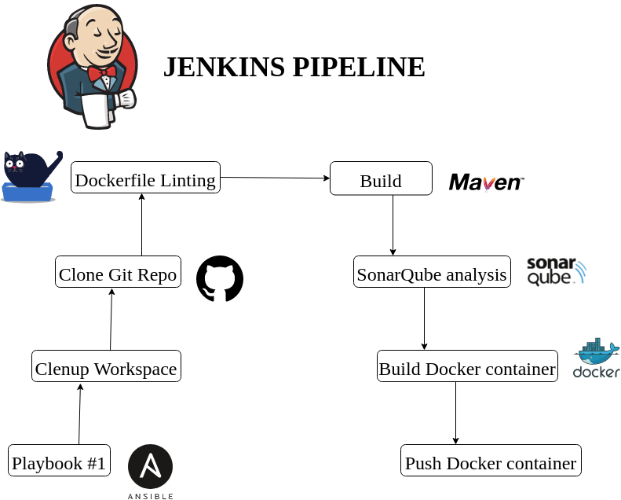
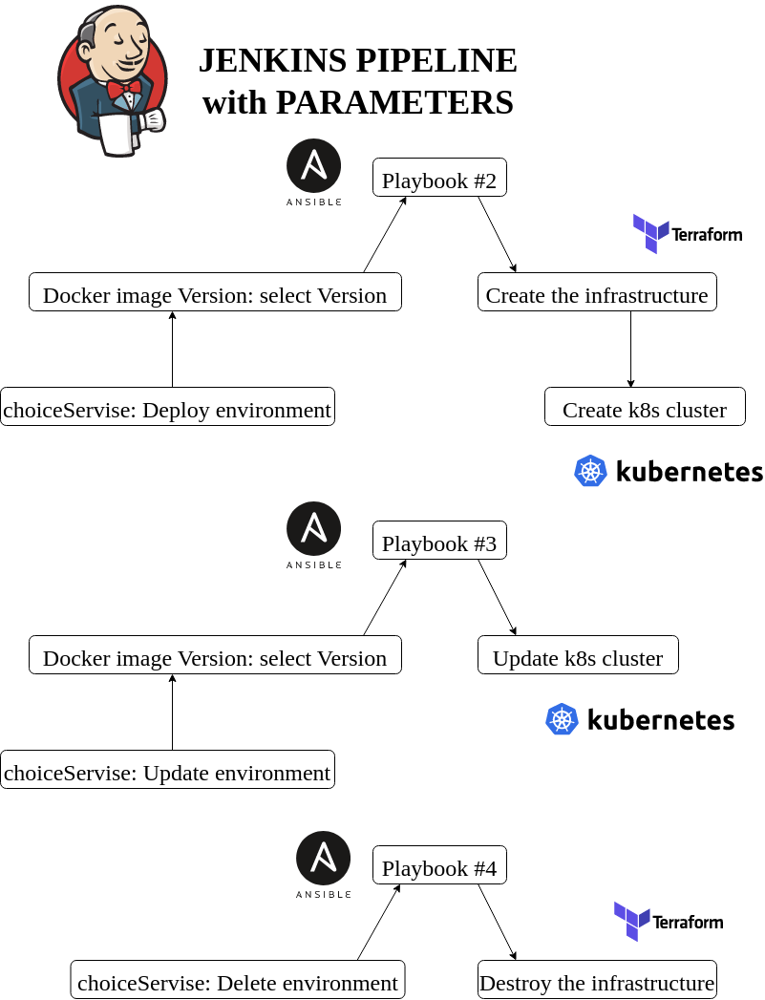

# My final task

**Accomplished a test project where demonstrate simple CI/CD pipeline.** 

**For this project used next technologies as Git, Jenkins, Ansible, SonarQube, Docker, Terraform, Kubernetes, GCP which handle build and deploy of simple Spring Boot application with these tools on GCP cloud.**

**Implemented creating Docker image, then deploying from Docker Hub, updating and destroying the infrastructure as Kubernetes cluster on GCP cloud with using current tools.**

